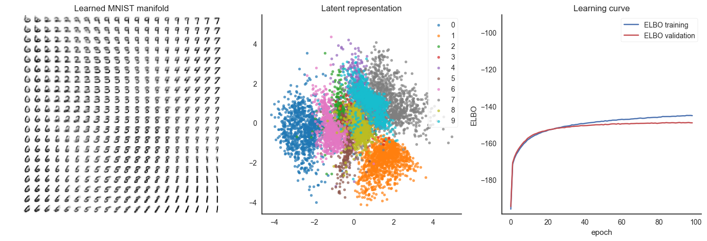

# Yet another variational autoencoder implementation
Implementation in tensorflow which follows the paper [Auto-Encoding Variational Bayes](https://arxiv.org/abs/1312.6114) by Kingma and Welling to check whether it really works. Just run the script with
```
python vae.py
```
and it should produce an output similar to this:

